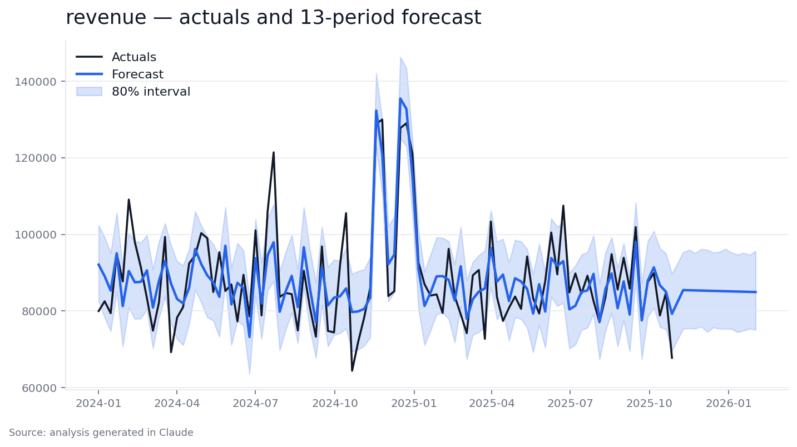
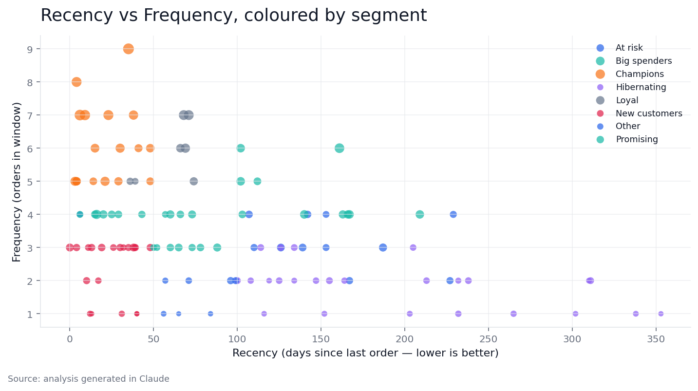
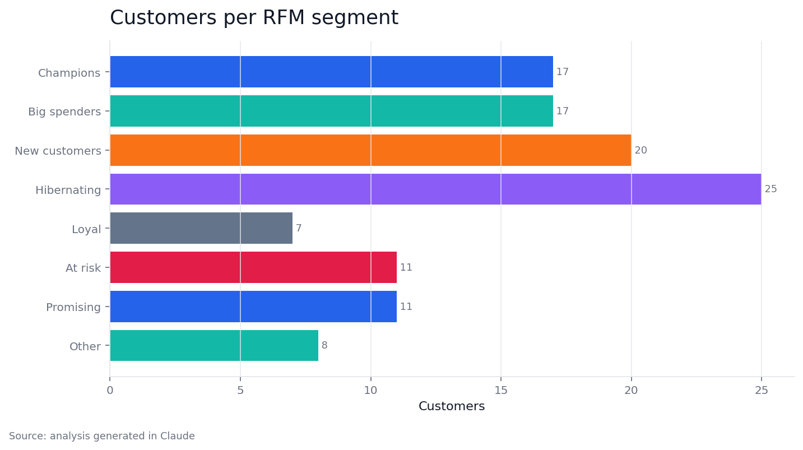

# Marketing Analytics Pack for Claude

A coherent skills pack for the people who work with marketing data — analysts, marketers, growth and lifecycle owners, product owners, founders — to do real analytical work in Claude, guided by a main planner, validated by a data readiness checker, and rendered through a shared visual style system.

> **Status:** 0.4.0 — 30 slash commands, three advanced runners (Prophet forecast, Google Meridian MMM, pandas/scikit RFM), shared visual style system, sample data, worked examples, and a `/report` sharing layer. Track progress in [CHANGELOG.md](./CHANGELOG.md).

## Why this exists

Most analytics tooling assumes you already know what to do. This pack assumes you don't. You bring a question and a CSV; the pack figures out what type of analysis you need, checks that your data can support it, and produces output that's screenshot-worthy without you touching a chart library.

## Who it's for

Anyone who works with marketing data — analysts, marketers, growth / lifecycle owners, product owners, founders. The bar is "you understand the question, you have or can get the data, but you'd rather not hand-roll the analysis or the chart code." The plugin's entry point is the **Main analysis planner**, which diagnoses your need and routes you to the right skill. The **Data readiness checker** validates your data before any work begins. When you want to share the output with a stakeholder, **`/report`** packages whatever the last skill produced (markdown + charts) into a single HTML, DOCX, PPTX, or PDF.

## Install

Add the marketplace once, then install the plugin.

From a shell (Claude Code CLI):

```
claude plugin marketplace add tamas-j/marketing-analytics-pack
claude plugin install marketing-analytics-pack@marketing-analytics-pack
```

From inside an interactive Claude session:

```
/plugin marketplace add tamas-j/marketing-analytics-pack
/plugin install marketing-analytics-pack@marketing-analytics-pack
```

Also planned for distribution via the official Anthropic plugin marketplace and 1–2 third-party Claude marketplaces; once listed there, `/plugin install marketing-analytics-pack@<marketplace>` will work without the marketplace-add step.

## What's in the pack

30 slash commands plus shared reference skills, across 7 analysis clusters and a sharing layer. The full checklist lives in the [URB-182 ticket](https://linear.app/urbsai/issue/URB-182/marketing-analytics-plugin-skills-pack-v1); high level:

- **Front door** — Style picker, Main analysis planner, Data readiness checker
- **Metrics** — KPI tree generator, Metric spec card generator, CLV scenario modeller, Customer journey measurement framework
- **Diagnosis** — Root cause investigation tree, Analysis brief generator, Churn driver narrative generator, Campaign post-mortem generator
- **Segmentation** — Segmentation method selector, RFM segment generator *(advanced runner)*, Persona-to-segment translator, Audience overlap visualiser
- **Experimentation** — Experiment design reviewer, Incrementality test designer, Attribution model selector, MMM readiness checker, MMM runner — Google Meridian *(advanced runner)*, MMM result interpreter
- **Forecasting** — Forecast method selector, Forecast runner — Prophet *(advanced runner)*
- **Marketing operations** — Suppression waterfall, Marketing taxonomy auditor, Frequency cap / fatigue analyser, NBA logic generator
- **Measurement & review** — Measurement triangulation (blended MMM + incrementality + attribution), Results skeptic (adversarial pre-share review)
- **Sharing** — Report builder for packaging markdown, charts, and runner outputs into HTML, DOCX, PPTX, or PDF

## Architecture

Skills are tiered by install weight. Most are **core skills** — prompt + matplotlib, install in seconds. A handful are **advanced runners** (RFM, Forecast/Prophet, MMM/Meridian) that declare heavier dependencies and pip-install them on first use.

Every skill that produces visuals follows a **shared style system**: chart code patterns live in a `data-visualization` reference skill (Claude copies them into generated code at runtime), brand and palette settings live in `lib/styles/*.yaml` (read at runtime by a thin helper), and a front-door **Style picker** skill lets you select or customise a style. Three bundled styles — `default`, `executive`, `custom` — plus optional brand mode (logo, primary colour, font). The point is that output across the whole pack is cohesive, screenshot-worthy, and copy-pasteable.

## Advanced runners — environment setup

Most of the 30 commands need nothing beyond the plugin itself. Three commands — `/forecast-runner` (Prophet), `/mmm-runner` (Google Meridian), and `/rfm-segment` (pandas / scikit) — ship in two modes:

- **Spec mode** is always available: Claude walks you through input schema, assumptions, validation plan, and expected outputs without executing anything. Works in every Claude surface, no setup.
- **Execution mode** runs a real Python script under `skills/<runner>/scripts/` against a CSV and emits a folder of styled charts plus a numeric summary. It needs Python 3.10+ and a shell-capable Claude surface (Claude Code or Cowork — not pure web chat).

To use execution mode, install the runner's dependencies once:

```bash
# Recommended: a per-pack virtual environment (works on PEP 668-managed systems)
python3 -m venv .venv
source .venv/bin/activate          # Linux / macOS
.venv\Scripts\activate             # Windows PowerShell

pip install -r skills/forecast-runner/scripts/requirements.txt
# (Repeat for skills/mmm-runner/ and skills/rfm-segment-generator/ as you start using them.)
```

Or pass `--auto-install` to the runner script and it will pip-install on first use, falling back to `--user` install if the system Python is externally managed.

Prophet and Meridian both pull binary wheels with bundled Stan / TensorFlow Probability and may take a few minutes to install the first time. Subsequent runs are fast.

## Data input (v1)

Files only — CSV, Excel, or pasted data. Database access is deferred to a later version. If you already have a warehouse MCP connected in Claude, point it at your table and describe the schema; the skills will work against that today, just not bundled.

## Repository layout

```
marketing-analytics-pack/
├── .claude-plugin/
│   ├── plugin.json      # plugin manifest (name, version, description, author)
│   └── marketplace.json # single-plugin marketplace manifest for direct install
├── commands/            # slash commands users invoke (e.g. /kpi-tree, /style, /forecast)
├── skills/              # composable knowledge units commands pull in (chart patterns, method comparisons, etc.)
├── lib/                 # shared brand/style config + a thin reader
│   └── styles/          # default / executive / custom YAML
├── docs/                # design notes, conventions, contribution guide
├── examples/            # sample datasets + worked example flows
└── scripts/             # validate.py and other repo tooling
```

## Screenshots

All charts use the bundled `default` style (3-layer style system: chart code patterns in `data-visualization` reference skill, palette / typography in `lib/styles/*.yaml`, thin reader in `lib/visualize.py`). Swap to `executive` or your own brand `custom.yaml` and every chart restyles consistently.

### Prophet forecast — 13-week horizon with 80% confidence interval



Run on `examples/data/mmm-weekly.csv` (96 weeks of revenue + paid search / paid social spend + holiday flag). Prophet beat both baselines on the holdout: **7.7% MAPE** vs seasonal naive 13.8% vs naive 17.6%.

### RFM segmentation — Recency vs Frequency scatter



Run on `examples/data/orders.csv` (400 transactions, 116 customers). Bubble size encodes Monetary value; segments are assigned via quintile rules. Champions cluster top-left (high recency, high frequency); Hibernating spread along the right (long since last purchase).

### RFM segment sizes — customers per segment



Same run, ordered by total revenue contribution. 17 Champions drive ~33% of revenue from 15% of the customer base — typical Pareto concentration, surfaced for VIP / referral programs.

## Example flow

See the `examples/` directory for worked flows across the front door, Metrics, Diagnosis, Segmentation, Marketing operations, Experimentation, and Forecasting command sets.

## Shareable artifacts

Use `/report` after any analysis to create a self-contained HTML file with the narrative, tables, embedded charts, report metadata, and brand styling from `lib/styles/`. HTML artifacts support report types such as `kpi-tree`, `metric-spec`, `clv-scenario`, `journey-framework`, `forecast`, `mmm`, and `rfm`, so recurring readouts can stay lightweight without needing a frontend/backend portal.

## License

MIT — see [LICENSE](./LICENSE).
